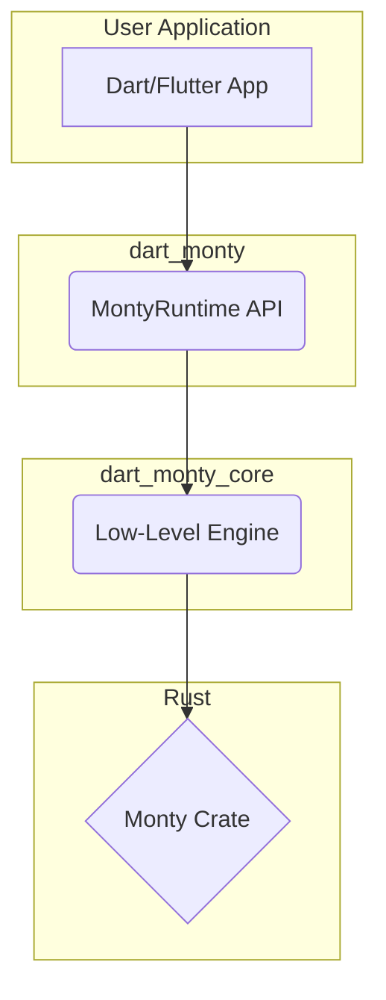
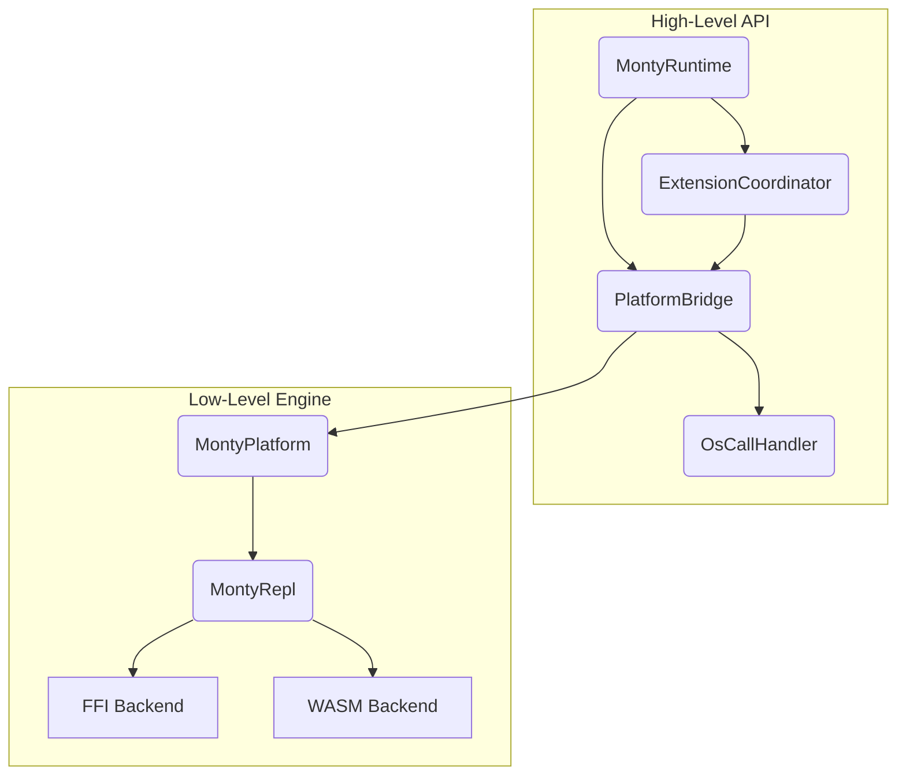
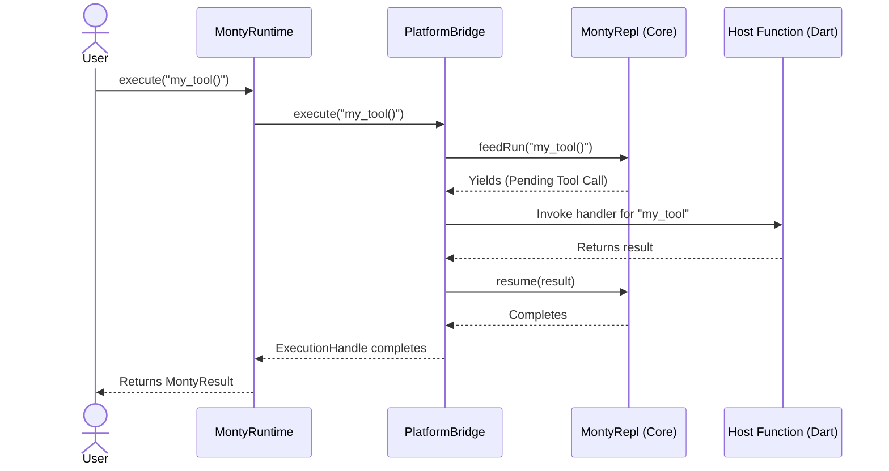

# dart_monty Architecture

## Quick Orientation

dart_monty is a pure Dart package that exposes the Monty sandboxed Python
interpreter to Dart and Flutter applications. It wraps pydantic's `monty`
Rust crate via two execution paths: native (FFI to a shared library) and
web (JS interop to a WASM module running in a Web Worker).

`MontyRuntime` is the recommended high-level API for stateful sessions with
extensions and OS-level interception.

## Architecture Diagrams

### Diagram 1: High-Level Package Dependency

This diagram provides a simple, high-level overview of the main components and their dependencies, illustrating how the packages fit together.



### Diagram 2: API Layering & Abstraction

This diagram illustrates the separation of concerns and how the APIs are layered, from the user-facing runtime down to the platform-specific backends.



### Diagram 3: Execution Flow for a Tool Call

This diagram shows the sequence of events when a user calls `execute` and the Python code invokes a host function (a "tool").



## Internal Module Structure

```text
dart_monty                           (high-level API package)
  │
  ├── lib/src/runtime/               (session management)
  │     ├── MontyRuntime              (high-level session facade)
  │     └── ExecutionHandle           (async execution control)
  │
  ├── lib/src/bridge/                (tool-calling layer)
  │     ├── PlatformBridge            (tool schema + dispatch logic)
  │     └── BridgeEvent               (streamable execution events)
  │
  ├── lib/src/extension/             (extension system)
  │     ├── MontyExtension            (abstract base)
  │     └── ExtensionCoordinator      (lifecycle and registration)
  │
  └── lib/src/os_call/               (VFS and OS-level interception)
        └── OsCallHandler             (operation interception logic)

dart_monty_core                      (low-level core engine package)
  │
  ├── lib/src/platform/               (abstract contract, pure Dart)
  │     ├── MontyPlatform              (abstract class)
  │     ├── MontyCoreBindings          (unified bindings contract)
  │     └── MontyResult, MontyException, MontyStackFrame, ...
  │
  ├── lib/src/repl/                   (stateful Python REPL)
  │     ├── MontyRepl                  (persistent Rust-backed REPL)
  │     └── ReplPlatform               (adapts MontyRepl to MontyPlatform)
  │
  ├── lib/src/ffi/                    (native FFI backend)
  │     └── MontyFfi                   (FFI implementation)
  │
  └── lib/src/wasm/                   (web WASM backend)
        └── MontyWasm                  (WASM implementation)
```

## Platform Support Matrix

| Platform | Module | Status | Library |
|----------|--------|--------|---------|
| macOS | dart_monty_core (FFI) | Supported | `.dylib` |
| Linux | dart_monty_core (FFI) | Supported | `.so` |
| Web | dart_monty_core (WASM) | Supported | WASM via Worker |
| iOS | dart_monty_core (FFI) | Planned (M9) | `.a` static |
| Android | dart_monty_core (FFI) | Planned (M9) | `.so` via NDK |
| Windows | dart_monty_core (FFI) | Planned (M9) | `.dll` via MSVC |

## Choosing the Right API

| Use case | API | Example |
|----------|-----|---------|
| Stateful session with tools | `MontyRuntime` | `final session = MontyRuntime(extensions: ...)` |
| Simple stateful evaluation | `MontyRepl` | `final repl = MontyRepl(); repl.feedRun('x=1')` |
| One-shot stateless evaluation | `Monty.exec()` | `await Monty.exec('2+2')` |

## Tool Calling & LLM Integration

The `MontyRuntime` and `PlatformBridge` serve two audiences simultaneously:

1. **Python side** -- host functions are callable from sandboxed Python by
   name (e.g., `search("query")`).
2. **LLM side** -- the same functions are advertised as tool schemas
   (`HostFunctionSchema`) that LLMs use to generate Python code.

This dual-audience pattern means you register a tool once and get both a
callable Python function and an LLM-compatible tool definition.

For the `OsCallHandler` layer, see [OsCall / VFS Layer](../deep-dives/oscall-vfs.md).
