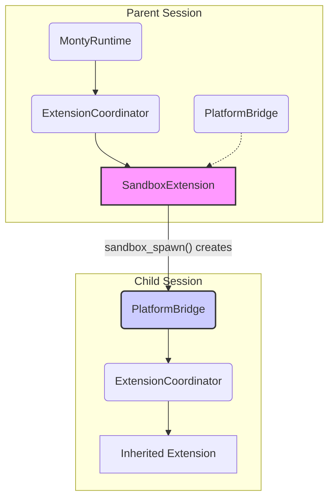

# Sandbox Architecture

## Overview

`SandboxExtension` spawns Python scripts in isolated child interpreters.
Each child gets its own `MontyPlatform` and `PlatformBridge`, and an
`ExtensionCoordinator` for inherited tools. The parent Python script
controls children via host functions.

### Architecture Diagram

This diagram shows how a parent `MontyRuntime` spawns an isolated child session.

### Cross-platform Support

`SandboxExtension` is fully supported on both native (FFI) and web (WASM).

| | Native (FFI) | Web (WASM) |
|---|---|---|
| Child interpreter | Fresh `MontyFfi` instance | Fresh `MontyRepl` session in shared Worker |
| Memory isolation | Separate Rust interpreter state | Separate Rust REPL heap |
| Parallelism | Sequential (parent's event loop) | Concurrent (shared Worker loop) |

## Host Functions

- `sandbox_spawn(code, timeout_ms?, memory_bytes?, system_prompt?)`
- `sandbox_await(handle)`
- `sandbox_await_all(handles)`
- `sandbox_gather(handles)`
- `sandbox_is_alive(handle)`
- `sandbox_free(handle)`
- `sandbox_get_output(handle)`

## Isolation Model

Each child gets:

- **Own `MontyPlatform`** — A fresh interpreter instance via the `platformFactory`.
- **Own `PlatformBridge`** — An independent dispatch loop and event stream.
- **Own `ExtensionCoordinator`** — A new coordinator with inherited extensions.
- **Own VFS (optional)** — Filesystem access controlled by the `childVfsStrategy`.

## Extension Inheritance

`SandboxExtension` relies on its parent `ExtensionCoordinator` to build the child's environment. It calls `coordinator.spawnChild()`, which iterates through all registered extensions and calls `MontyExtension.createChildInstance()` on each one, allowing them to be cloned for the child.

## Filesystem Inheritance (VFS)

The `childVfsStrategy` enum controls how a child's filesystem relates to its parent's:

- **`ChildVfsStrategy.isolated`** (default): Each child gets a fresh, empty `memoryFsHandler()`. No access to the parent's filesystem.
- **`ChildVfsStrategy.shared`**: The child shares the parent's `Path.*` handler. This is useful for shared workspaces but removes filesystem isolation.
- **`ChildVfsStrategy.none`**: The child has no filesystem access at all. Any `Path.*` operations will fail.
