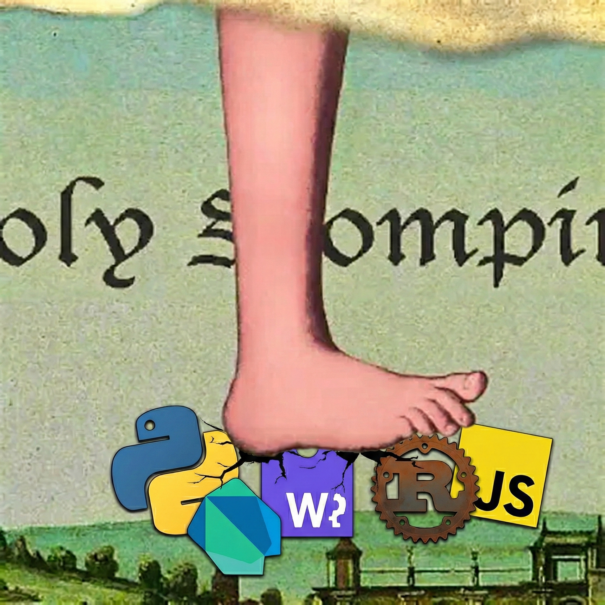

# Documentation

  

Sandboxed Python interpreter for Dart and Flutter. Run Python from native,
web, and mobile — one package, every platform.

> Looking for a quick taste? Try the [live REPL](repl.html) or the
> [agent demo](agent.html). For the API at a glance, see
> [User Guide → API Reference](user/api-reference.html).

## User Guide

Practical, task-oriented docs for adding `dart_monty` to a project.

- [Installation](user/install.html) — Add to your `pubspec.yaml`
- [Deployment](user/deployment.html) — Native and web deployment notes
- [REPL](user/repl.html) — Stateful interactive execution
- [Extensions](user/extensions.html) — Template, MessageBus, Sandbox
- [API Reference](user/api-reference.html) — Method-by-method summary

## Tutorials

Walkthroughs that build something real, step by step.

- [Host Functions Intro](tutorials/host-functions-intro.html)
- [Host Functions Beginner](tutorials/host-functions-beginner.html)
- [Host Functions Intermediate](tutorials/host-functions-intermediate.html)
- [Host Functions Advanced](tutorials/host-functions-advanced.html)
- [Bridge Middleware](tutorials/bridge-middleware.html)
- [LLM Prompt Rules](tutorials/llm-prompt-rules.html)

## Deep Dives

How the package works under the hood.

- [Architecture Overview](architecture/overview.html)
- [Sandbox Architecture](deep-dives/sandbox-architecture.html)
- [OsCall / VFS Layer](deep-dives/oscall-vfs.html)
- [Error Hierarchy](deep-dives/error-hierarchy.html)
- [Extension System](deep-dives/extension-system.html)
- [Bridge Concurrency](deep-dives/bridge-concurrency.html)

## Technical Reference

Source-of-truth references for the internal contract surface.

- [Native Crate (Rust)](reference/native-crate.html)
- [Monty Rust API](reference/monty-rust-api.html)
- [FFI Handle Lifecycle](reference/ffi-handle-lifecycle.html)
- [Bridge Integration](reference/bridge-integration.html)
- [Internals](reference/internals.html)
- [API Coverage Plan](reference/api-coverage-plan.html)

## Contributing

- [Development Setup](contributor/setup.html)
- [Testing](contributor/testing.html)

## For LLMs

A machine-readable index of this site is available at
[`/llms.txt`](llms.txt) — see [llmstxt.org](https://llmstxt.org) for the
spec.

## Source

Source lives at [github.com/runyaga/dart_monty](https://github.com/runyaga/dart_monty).
The companion package
[`dart_monty_core`](https://github.com/runyaga/dart_monty_core)
ships the low-level FFI/WASM bindings.
