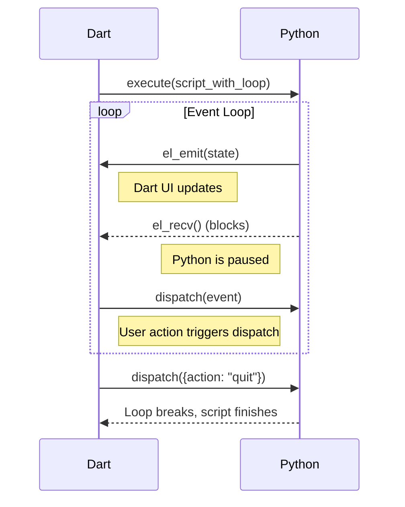

# Host Functions -- Intermediate

This guide covers organizing host functions into extensions, the extension
coordinator, namespace validation, lifecycle hooks, OS contributions,
child policies, and the `EventLoopExtension`.

**Prerequisites:** Read the [Beginner guide](host-functions-beginner.md) first.

## MontyExtension

For anything beyond a handful of functions, use `MontyExtension` to group
related functions into a namespaced, lifecycle-managed unit.

### Key Members

| Member | Purpose |
|--------|---------|
| `namespace` | Unique prefix for all function names (e.g., `storage_`) |
| `functions` | List of `HostFunction`s this extension provides |
| `pythonPreamble` | (Convention) Python wrapper source that consumers prepend to user code. Empty by default. See "Shipping Python wrapper code with an extension" below. |
| `typeCheckPrefix` | (Convention) Pure-declaration stubs of host functions, suitable for `Monty.typeCheck(prefixCode: ...)`. Empty by default. |
| `osContribution` | Prefix map for declarative OS call interception |
| `childPolicy` | How the extension propagates to child sandboxes |
| `priority` | Attachment order (higher priority attaches first) |
| `supportedBackends`| Which backends (FFI/WASM) this extension supports |
| `onAttach(ctx)` | Lifecycle hook called during attachment |
| `onDispose()` | Lifecycle hook called when the session ends |

### Example Extension

```dart
class StorageExtension extends MontyExtension {
  final Map<String, Object?> _store = {};

  @override
  String get namespace => 'storage';

  @override
  List<HostFunction> get functions => [
    HostFunction(
      schema: const HostFunctionSchema(
        name: 'storage_get',
        description: 'Get a value by key.',
        params: [HostParam(name: 'key', type: HostParamType.string)],
      ),
      handler: (args, ctx) async => _store[args['key']],
    ),
  ];

  @override
  Map<String, OsCallHandler>? get osContribution => {
    'os.storage_size': (op, args, kwargs) async => _store.length,
  };

  @override
  ChildPolicy get childPolicy => ChildPolicy.clone;

  @override
  MontyExtension createChildInstance(ChildSpawnContext context) =>
      StorageExtension();
}
```

## Shipping Python wrapper code with an extension

A pure host-function extension (like the built-in `JinjaTemplateExtension`)
exposes flat Python-callable names — `tmpl_render(template, context)`,
`msg_send(name, message)`, etc. These are already idiomatic Python from the
user's perspective; nothing else needs to ship.

Some extensions need a **higher-level Python layer** on top of low-level host
functions. A dataframe extension is the canonical example: the natural Python
API is `df = df_load_csv("data.csv")` returning a dict-like object, then
`df_select(df, "name", "age")` returning another. Implementing that as
host-only would force every host function signature to contain dataframe
serialisation logic. Cleaner: the host functions deal in opaque integer
handles, and a thin Python wrapper layer converts handles to/from
user-facing dicts.

### The pattern: `pythonPreamble` + `typeCheckPrefix`

By convention, an extension that ships Python code exposes two getters:

- **`String get pythonPreamble`** — the runtime wrapper code. Defines the
  user-facing names (`df_*`) on top of the host-callable names (`df_host_*`).
  May have side effects (e.g., installs a Python `logging.Handler`); runs
  in the live interpreter.
- **`String get typeCheckPrefix`** — forward declarations of the host
  functions, suitable for `Monty.typeCheck`. Pure declarations only — no side
  effects, no real implementations. The type analyser runs in an isolated heap
  with no host functions registered, so eager calls to `df_host_*` would fail
  at import time.

```dart
import 'package:dart_monty/dart_monty_bridge.dart';

/// Inlined verbatim from `lib/python/dataframe.py` — keep in sync.
const String _pythonWrapperSource = '''
# dataframe.py — Monty-compatible Python wrapper.
# No classes, no decorators, no generators. Dataframes are passed
# around as opaque dicts wrapping a host-side handle.

def df_load_csv(path):
    return {'_kind': 'dataframe', '_handle': df_host_load_csv(path)}

def df_select(df, *cols):
    return {'_kind': 'dataframe',
            '_handle': df_host_select(df['_handle'], list(cols))}

def df_records(df):
    return df_host_to_records(df['_handle'])
''';

class DataframeExtension extends MontyExtension {
  @override
  String get namespace => 'df';

  /// Forward declarations for the host functions registered below, so
  /// `Monty.typeCheck` can resolve them. Pure declarations — no side
  /// effects.
  String get typeCheckPrefix => '''
def df_host_load_csv(path: str) -> int: return 0
def df_host_select(handle: int, cols) -> int: return 0
def df_host_to_records(handle: int): return []
''';

  /// Runtime wrapper that exposes the user-facing `df_*` names.
  String get pythonPreamble => _pythonWrapperSource;

  @override
  List<HostFunction> get functions => [
    HostFunction(
      schema: const HostFunctionSchema(
        name: 'df_host_load_csv',
        params: [HostParam(name: 'path', type: HostParamType.string)],
      ),
      handler: _handleLoadCsv,
    ),
    // ... other df_host_* functions
  ];
}
```

> **Note:** `pythonPreamble` and `typeCheckPrefix` are **not** declared on
> the base `MontyExtension` class — they're a convention. Add them as plain
> getters; consumers of your extension look for those exact names.

### Consumer pattern: prepend the preamble

> **⚠ The extension does NOT auto-inject the preamble.** Calling
> `runtime.execute(userCode)` directly will fail with
> `RuntimeError('Unknown function df_load_csv')` — the host functions
> exist but the Python wrappers that call them aren't in scope.
> **You must prepend `ext.pythonPreamble` to the code yourself**
> before each `execute()` (see the example below). This is by design:
> `MontyExtension.onAttach` deliberately does not feed Python source
> into the interpreter, keeping the extension API decoupled from
> runtime internals.

Consumers concatenate the preamble to user code before `runtime.execute`:

```dart
import 'package:dart_monty/dart_monty.dart';
import 'package:dart_monty/dart_monty_bridge.dart';
import 'package:dart_monty_dataframe/dart_monty_dataframe.dart';

Future<void> main() async {
  final ext = DataframeExtension();
  final runtime = MontyRuntime(extensions: [ext]);

  const userCode = '''
df = df_load_csv("/data/sales.csv")
top = df_select(df, "name", "amount")
records = df_records(top)
''';

  // 1. Pre-flight typeCheck: prepend BOTH typeCheckPrefix (declares
  //    df_host_*) AND pythonPreamble (defines df_*) so the analyser can
  //    resolve every name user code touches.
  final errors = await Monty.typeCheck(
    userCode,
    prefixCode: '${ext.typeCheckPrefix}\n${ext.pythonPreamble}',
  );
  if (errors.isNotEmpty) {
    return; // reject before reaching the interpreter
  }

  // 2. Execute: prepend pythonPreamble (the runtime wrappers).
  final result = await runtime
      .execute('${ext.pythonPreamble}\n\n$userCode')
      .result;
  print(result.value);

  await runtime.dispose();
}
```

### Shared mode vs sandbox mode

`MontyRuntime` defaults to **shared mode**: a single REPL persists across all
`execute()` calls. In shared mode you only need to prepend the preamble
**once** — the subsequent definitions stick in the interpreter heap. A common
pattern is to call `runtime.execute(ext.pythonPreamble)` at startup, then
`runtime.execute(userCode)` for each subsequent call.

In **sandbox mode** (`MontyRuntime(sandbox: true, ...)`), every `execute()`
call creates a fresh interpreter — the preamble must be prepended on every
call. The shared-mode-prepend-once optimisation does not apply.

For child interpreters spawned by `SandboxExtension`, the parent's extensions
are reattached to each child (subject to `ChildPolicy`). The child gets the
host functions back, but **must also prepend the preamble** — children get a
fresh Python heap.

### When NOT to use this pattern

Skip the preamble pattern when your extension's host functions are already
the user-facing API:

- `JinjaTemplateExtension` exposes `tmpl_render(template, context)` — no
  wrapper needed.
- `MessageBusExtension` exposes `msg_send`, `msg_recv`, `msg_peek`,
  `msg_close`, `msg_stats` — flat function calls, no wrapper.

The preamble pattern earns its keep when there's a meaningful indirection
between "what's idiomatic Python" and "what the host can implement
efficiently" — opaque handles, dict-shaped wrappers, monkey-patched stdlib
hooks.

### Multi-extension preambles

When a `MontyRuntime` has multiple extensions, concatenate every extension's
preamble in registration order. A small helper makes this readable:

```dart
String composedPreamble(MontyRuntime runtime) {
  final exts = runtime.extensions ?? const <MontyExtension>[];
  final parts = <String>[];
  for (final e in exts) {
    final pre = (e as dynamic).pythonPreamble as String? ?? '';
    if (pre.isNotEmpty) parts.add(pre);
  }
  return parts.join('\n');
}

final fullCode = '${composedPreamble(runtime)}\n\n$userCode';
```

The cast handles the convention-not-API distinction: extensions that don't
expose `pythonPreamble` still work, they just contribute nothing.

---

## ExtensionCoordinator

`ExtensionCoordinator` collects extensions, validates them, and wires them onto
a bridge:

```dart
final coordinator = ExtensionCoordinator()
  ..register(StorageExtension())
  ..register(MathExtension());

await coordinator.attachTo(bridge);
```

### OS Contributions

Extensions can intercept OS calls (like `pathlib` or `os`) declaratively
via `osContribution`. The coordinator merges these from all extensions:

```dart
@override
Map<String, OsCallHandler> get osContribution => {
  'Path.': _myHandler,
  'os.': _myHandler,
};
```

If two extensions claim the same prefix, `attachTo()` throws a `StateError`.

### Child Policies

When a child sandbox is spawned (via `SandboxExtension`), the parent
coordinator propagates extensions to the child based on their `childPolicy`:

- **`ChildPolicy.exclude`** (default): The extension is not present in children.
- **`ChildPolicy.inherit`**: The same instance is shared with the child.
- **`ChildPolicy.clone`**: `createChildInstance()` is called to create a fresh
  copy for the child.

## EventLoopExtension

`EventLoopExtension` turns a one-shot `execute()` call into a long-running
cooperative exchange.

### Flow Diagram


### The Pattern

Python calls `el_recv()` to pause and `el_emit(value)` to push data back:

```python
while True:
    el_emit({"status": "ready"})
    event = el_recv() # Blocks until Dart calls dispatch()
    if event["action"] == "quit": break
```

### Dart Side

```dart
final ext = EventLoopExtension();
final session = MontyRuntime(extensions: [ext]);

ext.lastEmittedSignal.subscribe((v) => print('Python: $v'));
session.execute(script);

ext.dispatch({'action': 'quit'});
```

## Next Steps

The [Advanced guide](host-functions-advanced.md) covers deep-dives into
`SandboxExtension` and complex production patterns.
