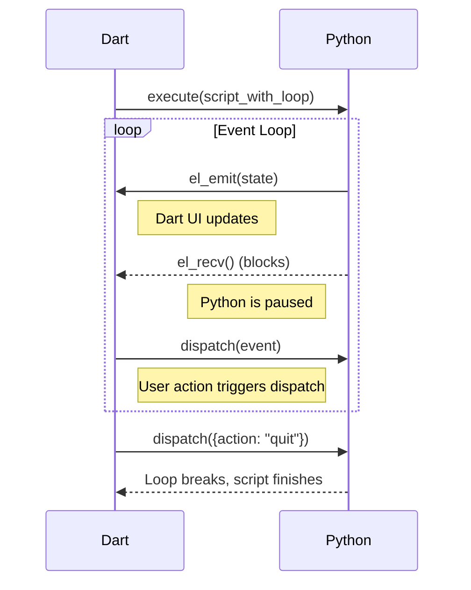

# Host Functions -- Intermediate

This guide covers organizing host functions into extensions, the extension
coordinator, namespace validation, lifecycle hooks, OS contributions,
child policies, and the `EventLoopExtension`.

**Prerequisites:** Read the [Beginner guide](host-functions-beginner.md) first.

## MontyExtension

For anything beyond a handful of functions, use `MontyExtension` to group
related functions into a namespaced, lifecycle-managed unit.

### Key Members

| Member | Purpose |
|--------|---------|
| `namespace` | Unique prefix for all function names (e.g., `storage_`) |
| `functions` | List of `HostFunction`s this extension provides |
| `osContribution` | Prefix map for declarative OS call interception |
| `childPolicy` | How the extension propagates to child sandboxes |
| `priority` | Attachment order (higher priority attaches first) |
| `supportedBackends`| Which backends (FFI/WASM) this extension supports |
| `onAttach(ctx)` | Lifecycle hook called during attachment |
| `onDispose()` | Lifecycle hook called when the session ends |

### Example Extension

```dart
class StorageExtension extends MontyExtension {
  final Map<String, Object?> _store = {};

  @override
  String get namespace => 'storage';

  @override
  List<HostFunction> get functions => [
    HostFunction(
      schema: const HostFunctionSchema(
        name: 'storage_get',
        description: 'Get a value by key.',
        params: [HostParam(name: 'key', type: HostParamType.string)],
      ),
      handler: (args, ctx) async => _store[args['key']],
    ),
  ];

  @override
  Map<String, OsCallHandler>? get osContribution => {
    'os.storage_size': (op, args, kwargs) async => _store.length,
  };

  @override
  ChildPolicy get childPolicy => ChildPolicy.clone;

  @override
  MontyExtension createChildInstance(ChildSpawnContext context) =>
      StorageExtension();
}
```

## ExtensionCoordinator

`ExtensionCoordinator` collects extensions, validates them, and wires them onto
a bridge:

```dart
final coordinator = ExtensionCoordinator()
  ..register(StorageExtension())
  ..register(MathExtension());

await coordinator.attachTo(bridge);
```

### OS Contributions

Extensions can intercept OS calls (like `pathlib` or `os`) declaratively
via `osContribution`. The coordinator merges these from all extensions:

```dart
@override
Map<String, OsCallHandler> get osContribution => {
  'Path.': _myHandler,
  'os.': _myHandler,
};
```

If two extensions claim the same prefix, `attachTo()` throws a `StateError`.

### Child Policies

When a child sandbox is spawned (via `SandboxExtension`), the parent
coordinator propagates extensions to the child based on their `childPolicy`:

- **`ChildPolicy.exclude`** (default): The extension is not present in children.
- **`ChildPolicy.inherit`**: The same instance is shared with the child.
- **`ChildPolicy.clone`**: `createChildInstance()` is called to create a fresh
  copy for the child.

## EventLoopExtension

`EventLoopExtension` turns a one-shot `execute()` call into a long-running
cooperative exchange.

### Flow Diagram


### The Pattern

Python calls `el_recv()` to pause and `el_emit(value)` to push data back:

```python
while True:
    el_emit({"status": "ready"})
    event = el_recv() # Blocks until Dart calls dispatch()
    if event["action"] == "quit": break
```

### Dart Side

```dart
final ext = EventLoopExtension();
final session = MontyRuntime(extensions: [ext]);

ext.lastEmittedSignal.subscribe((v) => print('Python: $v'));
session.execute(script);

ext.dispatch({'action': 'quit'});
```

## Next Steps

The [Advanced guide](host-functions-advanced.md) covers deep-dives into
`SandboxExtension` and complex production patterns.
